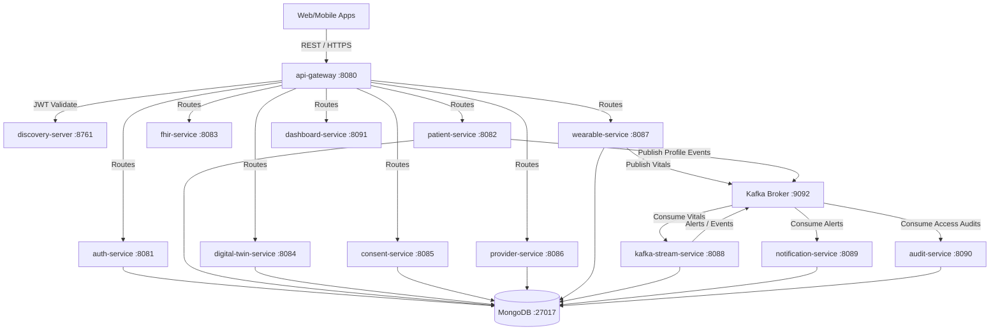

# Infosys MediSphere: Enterprise Healthcare Management Platform

Infosys MediSphere is a state-of-the-art, production-ready enterprise healthcare platform designed with a high-performance **Microservices Architecture**. The platform implements **Domain-Driven Design (DDD)**, **Clean Architecture**, and **SOLID** principles, with **Event-Driven Streaming** (Kafka) and flexible document persistence (MongoDB).

---

## 1. System Architecture & Topology



---

## 2. Directory Structure

The repository is structured as a multi-module Maven project where each microservice represents a fully isolated domain:

```
Infosys-MediSphere/
│
├── pom.xml                      # Parent multi-module Maven build
├── common-library/              # Shared DTOs, Exceptions, and JWT helpers
├── discovery-server/            # Netflix Eureka Registry Server
├── config-server/               # Centralized property configuration
├── api-gateway/                 # Gateway routes, JWT filter, and rate limiter
├── auth-service/                # User login, JWT emission, SMART on FHIR
├── patient-service/             # Patient CRUD and demographic registration
├── fhir-service/                # FHIR R4 standard structures parser
├── digital-twin-service/        # Digital health twin merger and completeness check
├── consent-service/             # Patient privacy and Doctor authorizations
├── provider-service/            # Doctors and clinic directories
├── wearable-service/            # Pairing wearable data to streaming queue
├── kafka-stream-service/        # Ingesting vitals, boundary checking, DLQ logic
├── notification-service/        # SMS, Email, and Push alarms dispatcher
├── audit-service/               # HIPAA audit database recorder
├── dashboard-service/           # Unified Patient 360 view aggregator
├── docker/                      # Docker-compose local runner scripts
├── kubernetes/                  # Deployment, service, and ingress YAML scripts
└── monitoring/                  # Prometheus scraping configurations
```

---

## 3. Technology Stack & Prerequisites

*   **Java Runtime**: Version 21 or newer (Java 25 verified).
*   **Application Framework**: Spring Boot 3.3.x / Spring Cloud 2023.0.x.
*   **Database Engine**: MongoDB (v6.x+).
*   **Streaming Platform**: Apache Kafka / Confluent v7.x.
*   **Orchestration**: Docker Compose or Kubernetes (Minikube / EKS).

---

## 4. Getting Started (Local Run book)

### Phase A: Compile and Package the Modules

From the root project directory `Infosys-MediSphere/`, trigger a Maven clean compilation to package the JAR files:

```bash
mvn clean install -DskipTests
```

### Phase B: Launch via Docker Compose

Spin up databases, streaming queues, microservice instances, and gateways with a single command:

```bash
cd docker
docker-compose up --build -d
```

Confirm all containers are healthy:

```bash
docker ps
```

### Phase C: Accessing Platform Services

*   **Eureka Discovery Console**: [http://localhost:8761](http://localhost:8761)
*   **API Gateway entry point**: [http://localhost:8080](http://localhost:8080)
*   **Config Server Dashboard**: [http://localhost:8888/actuator/health](http://localhost:8888/actuator/health)

---

## 5. Security & SMART on FHIR Compliance

1.  **JWT Authentication**: The `api-gateway` enforces a signature check on all inbound HTTP authorization headers. Tokens are parsed, verified, and forward headers (`X-Auth-User`, `X-Auth-Roles`) are generated downstream.
2.  **Consent Validation**: Before doctor access is granted to observation fields, `dashboard-service` invokes `consent-service` at `/consent/check` verifying valid, active, non-expired HIPAA agreements.
