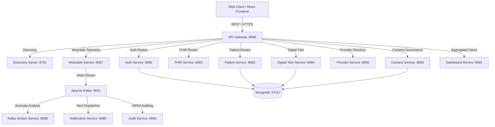

# MediSphere: Enterprise Healthcare Management Platform

[](https://spring.io/projects/spring-boot)
[](https://reactjs.org/)
[](https://www.typescriptlang.org/)
[](https://kafka.apache.org/)
[](https://www.mongodb.com/)

**MediSphere** is an enterprise-grade, microservices-driven healthcare management platform designed for real-time patient monitoring, AI biometric anomaly detection, digital twin modeling, and HIPAA-compliant consent governance.

---

## 🌟 Key Features

*   **Patient 360 & Digital Twins**: Complete longitudinal patient profiles with live dynamic vitals streaming and condition tracking.
*   **Doctor-Patient Assignment Portal**: Admin-managed patient allocation with seamless multi-doctor support.
*   **AI Biometric Prediction & Anomaly Detection**: Integrated AI risk modeling, SHAP explainability, and telemetry threshold monitoring.
*   **Live Vitals Telemetry**: Dynamic 10-second real-time streaming, trend waveforms, and immediate SOS alert dispatching.
*   **Microservices Architecture**: Powered by Spring Cloud Gateway, Eureka Service Discovery, Apache Kafka, and MongoDB.
*   **SMART on FHIR & Privacy**: HIPAA consent agreements, role-based access control (RBAC), and automated audit logs.

---

## 🏗️ System Architecture



---

## 📁 Repository Structure

```
MediSphere/
│
├── Infosys-MediSphere/          # Java Spring Boot Microservices
│   ├── api-gateway/            # Central entry point & JWT authentication
│   ├── auth-service/           # User authentication & RBAC
│   ├── patient-service/        # Patient records & doctor assignments
│   ├── fhir-service/           # HL7 / FHIR R4 standard structures
│   ├── digital-twin-service/   # Digital twin health models
│   ├── consent-service/        # Privacy consent governance
│   ├── wearable-service/       # Telemetry ingestion
│   ├── kafka-stream-service/   # Real-time event streaming
│   ├── notification-service/   # Emergency alerts & SMS/Email notifications
│   └── audit-service/          # HIPAA audit logging
│
├── medisphere-frontend/         # Modern React + TypeScript + Vite Dashboard
│   ├── src/pages/admin/        # Patient Assignment & System Health
│   ├── src/pages/patient/      # Patient 360 & Search Portal
│   ├── src/pages/live-vitals/  # Dynamic Live Vitals Waveform Stream
│   ├── src/pages/ai/          # AI Anomaly & Risk Prediction
│   └── src/pages/monitoring/  # Real-time Monitoring & Alert Center
│
└── medisphere-backend/          # Node.js / Express auxiliary API service
```

---

## 🚀 Quick Start Guide

### Prerequisites
- **Java JDK**: 21 or newer
- **Node.js**: v18+ & npm
- **MongoDB**: Running on `localhost:27017`
- **Apache Kafka**: Running on `localhost:9092` (optional for local demo fallback mode)

### Running the Frontend
```bash
cd medisphere-frontend
npm install
npm run dev
```
Open [http://localhost:5173](http://localhost:5173) in your browser.

---

## 👥 Contributors

Thanks to the following team members for building and contributing to **MediSphere**:

| Contributor | GitHub Profile | Role / Focus |
|---|---|---|
| **Abhilash Chaudhary** | [@abhilash-chaudhary](https://github.com/abhilash-chaudhary) | Project Lead & Full Stack Architect |
| **Varshith** | [@Varshith0708](https://github.com/Varshith0708) | Core Developer / Contributor |
| **Farheen Banu** | [@Farheen-Banu26](https://github.com/Farheen-Banu26) | Core Developer / Contributor |
| **Kalpana Devi** | [@kalpanadevi1727](https://github.com/kalpanadevi1727) | Core Developer / Contributor |

---

## 📄 License
This project is developed for enterprise healthcare management demonstration. All rights reserved.
